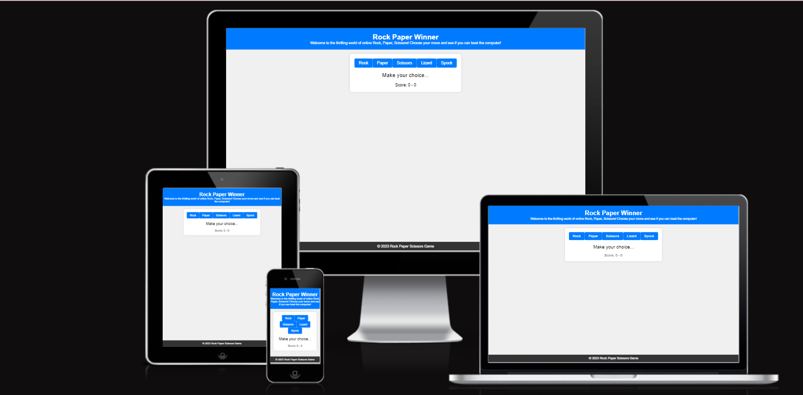
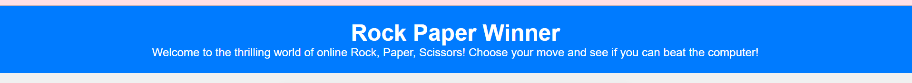
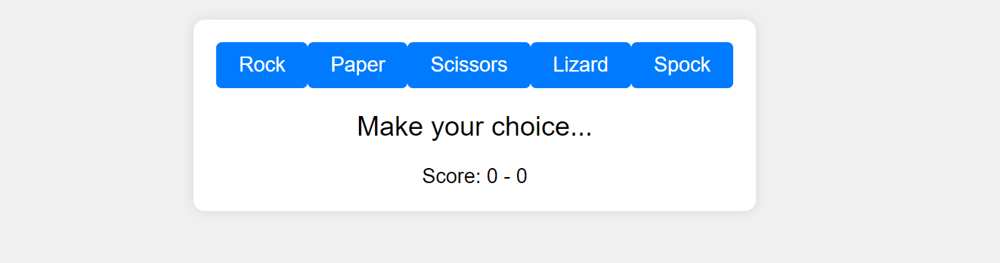
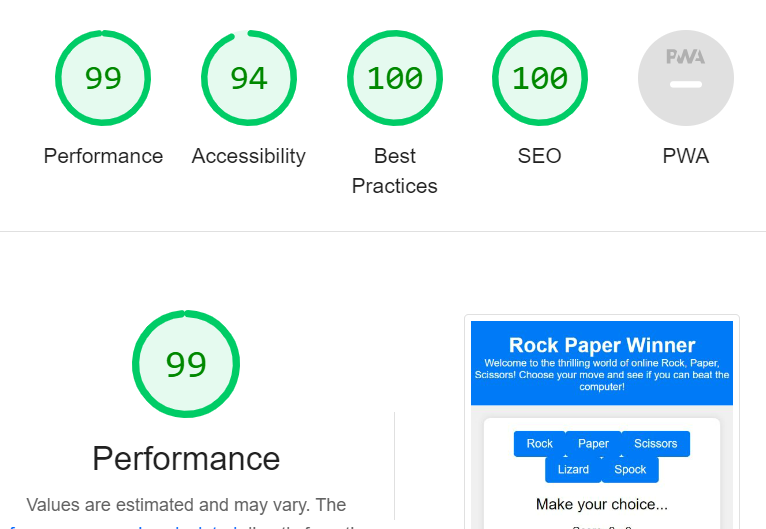

# Rock Paper Winner
Welcome to the Rock, Paper, Winner  game! This JavaScript-based web application allows you to play an extended version of the classic Rock, Paper, Scissors game against a computer opponent.

This web application is a fun and interactive way to test your decision-making skills against the computer. The game follows the rules of the original Rock, Paper, Scissors game with the addition of two extra options, Lizard and Spock, creating more possible outcomes and strategic choices.

Link to deployed website: https://melisaavr.github.io/rock_paper_winner/

## Features

### Header
It is simple and gets straight to the point with a clear explanation on what the game is about. 

### Gaming Zone
Random Computer Choices: The computer makes random selections to keep the game exciting and unpredictable.

Score Tracking: The scoreboard displays your wins and the computer's wins for each round.

Game Over Screen: When the game concludes, a game-over screen announces the winner and allows you to play again

The game allows players to choose from a set of five options: Rock, Paper, Scissors, Lizard, and Spock.
These choices are stored in the `choices` array, ensuring a variety of options for players to select from.

Player and computer scores, the current round, and the game state are initialized.
The "Play Again" button is initially hidden from view to prevent premature resets.

The `playGame` function handles the logic for playing a round of the game.
It compares the player's choice to the computer's choice and determines the round result.
The result is displayed in the `resultText` element, and scores are updated in the `scoreDisplay`.
Players can play up to three rounds before reaching the end of the game.

### Footer
The footer usually provides navigations and contact details, however, in this case, a rock paper scissors game does not require any extra navigations or contact details. This footer is simply for aesthetic reasons. 

## Testing
All tests have been carried out and the page works in browsers such as google chrome and Firefox.

Responsiveness: responsiveness test passed.

The navigation, header and the whole website in general are easy to read and use.

## Bugs
### Solved Bugs: 
Removing repeated code. Certain code has been repeated up to 3 times. 

## Validator Testing
HTML - No errors visible with W3C HTML validator

CSS- No errors visible with W3C CSS validator (jigsaw)

Javascript Validator - JS Hint - No Errors Found

Warning was fixed. 

Accessibility - passed using lighthouse in devtools.

## Thought Process Formation

## Deployment
GitHub Pages were used to host the website. The following are the deployment steps: Go to the Settings tab in the GitHub repository. Click "Save" after selecting the Main Branch from the drop-down menu for the source section. The page will automatically reload with a thorough ribbon display to show that the deployment was successful.

The link  (https://melisaavr.github.io/rock_paper_winner/) can be found here.

## Credits
How to use event listeners: 
https://www.tutorialspoint.com/how-to-remove-event-handlers-in-javascript#:~:text=Using%20the%20removeEventListener()%20method,is%20disabled%20after%20one%20click

Footer: 

https://materializecss.com/footer.html

