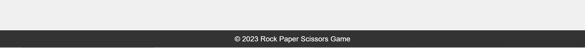

# Rock Paper Winner
Welcome to the Rock, Paper, Winner  game! This JavaScript-based web application allows you to play an extended version of the classic Rock, Paper, Scissors game against a computer opponent.

This web application is a fun and interactive way to test your decision-making skills against the computer. The game follows the rules of the original Rock, Paper, Scissors game with the addition of two extra options, Lizard and Spock, creating more possible outcomes and strategic choices.

Link to deployed website: https://melisaavr.github.io/rock_paper_winner/

Responsiveness: 

## First time Visitor Goals
* As a first time visitor, I want to understand what I must do to play the game. 
* As a first time visitor, I want to know when I have won or have been defeated by the computer which I am playing against. 

## Features

### Header
It is simple and gets straight to the point with a clear explanation on what the game is about. 

### Gaming Zone
Random Computer Choices: The computer makes random selections to keep the game exciting and unpredictable.

Score Tracking: The scoreboard displays your wins and the computer's wins for each round.

Game Over Screen: When the game concludes, a game-over screen announces the winner and allows you to play again

The game allows players to choose from a set of five options: Rock, Paper, Scissors, Lizard, and Spock.
These choices are stored in the `choices` array, ensuring a variety of options for players to select from.

Player and computer scores, the current round, and the game state are initialized.
The "Play Again" button is initially hidden from view to prevent premature resets.

The `playGame` function handles the logic for playing a round of the game.
It compares the player's choice to the computer's choice and determines the round result.
The result is displayed in the `resultText` element, and scores are updated in the `scoreDisplay`.
Players can play up to three rounds before reaching the end of the game.

### Footer
The footer usually provides navigations and contact details, however, in this case, a rock paper scissors game does not require any extra navigations or contact details. This footer is simply for aesthetic reasons. 

## Testing

### Compatibility
All tests have been carried out and the page works in browsers such as google chrome and microsoft edge. 
* Microsoft Edge: 

* Google Chrome: 

Responsiveness: responsiveness test passed.
The website was checked with [Responsive Website Design Tester](https://responsivedesignchecker.com/)

i. Mobile Screens

* Mobile 320 x 480

* Mobile 320 x 568

* Mobile 360 x 640 

* Mobile 375 x 667

* Mobile 411 x 731

* Mobile 414 x 736

ii. Tablet Screens

* Tablet 600 x 960

* Tablet 1024 x 768

* Tablet 1366 x 1024

* Tablet 768 x 1024

iii. Desktop Screens
* Desktop 1024 x 600

* Desktop 1024 x 800

* Desktop 1366 x 768

* Desktop 1440 x 900

* Desktop 1600 x 900 

* Desktop 1680 x 1050

* Desktop 1920 x 1080

* Desktop 1920 x 1200 

The navigation, header and the whole website in general are easy to read and use.

## Bugs
### Solved Bugs: 
Removing repeated code. Certain code has been repeated up to 3 times. 

Repeated choices by the computer - I have used const computerChice instead of let, this led to the computer always giving the same answers. I have fixed this. 

Computer chose "undefined" when displaying game choices. I have changed "computerChoice" to "generateComputerChoice" to avoid naming conflicts and ensure the computer's choice is generated and displayed correctly. 

Removed spaces between images used for read me by adding "_".

### Unsolved Bugs: 
None

## Validator Testing
HTML - No errors visible with W3C HTML validator

CSS- No errors visible with W3C CSS validator (jigsaw)

Javascript Validator - JS Hint - No Errors Found

Warning was fixed. 

Accessibility - passed using lighthouse in devtools.

## Thought Process Formation

## Technologies Used
* [HTML](https://developer.mozilla.org/en-US/docs/Web/HTML)- was used as the foundation of the site.
* [CSS](https://developer.mozilla.org/en-US/docs/Web/css-) was used to add the styles and layout of the site.
* [JS](https://www.w3schools.com/js/) - was used to add interactivity to the site.
* [VSCode](https://code.visualstudio.com/) was used as the main tool to write and edit code.
* [GitHub](https://github.com/) was used to host the code of the website.
* [CSS Flexbox](https://developer.mozilla.org/en-US/docs/Learn/CSS/CSS_layout/Flexbox)- was used to arrange items symmetrically on the pages.

## Design

Electric Blue is a bright and vibrant shade of blue that can convey a sense of energy, modernity, and dynamism. In design and branding, the choice of color is crucial as it can influence perceptions and emotions. It is the main colour users see before making their decision against the computer.

This specific shade of green is considered visually comfortable and are often used in design for their calming effects. This specific green might be chosen for its ability to create a positive and soothing visual experience. It is used for the "play again" button, therefore, it gives a sense of calmness before starting fresh. 

Deeper shades of blue are often used in the technology and finance sectors, conveying a sense of reliability and trustworthiness. In this case, it is sending a message of trustworthiness before the user/player clicks on the button. This shade of blue is only used when the player is hovering over the game buttons. 

Gray is often associated with neutrality and can be used as a neutral background or base color in various designs. It is a common choice for creating a subtle and understated aesthetic. For this reason, it was used as the background colour of the game's footer. Simple and neutral. 

Lighter gray used to balance the overall color palette and prevent it from becoming too overwhelming. When the button is disabled and no longer in use, it turns lighter gray to notify the user that the game is over. This is so that it is not so confusing and straight forward. 

## Deployment
GitHub Pages were used to host the website. The following are the deployment steps: Go to the Settings tab in the GitHub repository. Click "Save" after selecting the Main Branch from the drop-down menu for the source section. The page will automatically reload with a thorough ribbon display to show that the deployment was successful.

The link  (https://melisaavr.github.io/rock_paper_winner/) can be found here.

###  Local Deployment
* In order to make a local copy of this project, you can clone it. In your IDE Terminal, type the following command to clone my repository:

> git clone https://github.com/Melisaavr/rock_paper_winner.git

## Credits
How to use event listeners: 
https://www.tutorialspoint.com/how-to-remove-event-handlers-in-javascript#:~:text=Using%20the%20removeEventListener()%20method,is%20disabled%20after%20one%20click

Footer: 

https://materializecss.com/footer.html

Thank you to Git Hub and VsCode for making it easy to code and deploy my projects effortlessly